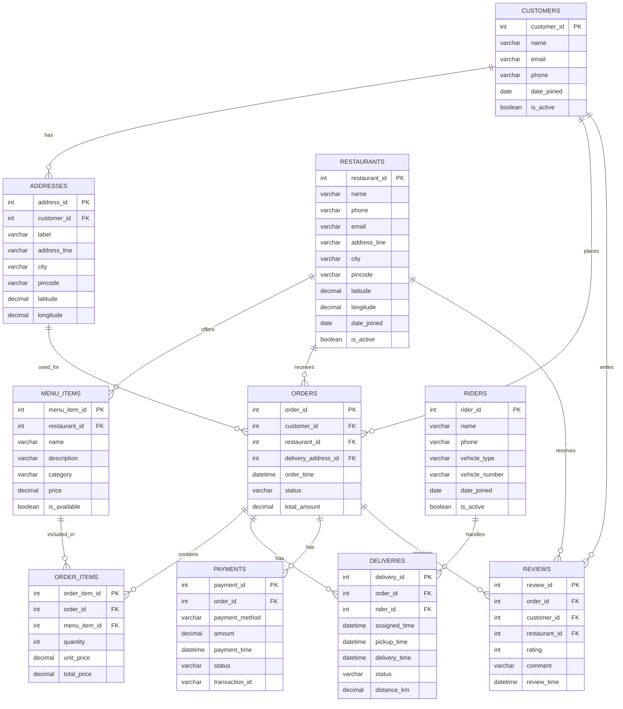

# Entity Relationship Diagram

The Delivery & Restaurant Analytics System uses a relational database consisting of 10 main entities.

```mermaid
erDiagram

    CUSTOMERS {
        int customer_id PK
        varchar name
        varchar email
        varchar phone
        date date_joined
        boolean is_active
    }

    ADDRESSES {
        int address_id PK
        int customer_id FK
        varchar label
        varchar address_line
        varchar city
        varchar pincode
        decimal latitude
        decimal longitude
    }

    RESTAURANTS {
        int restaurant_id PK
        varchar name
        varchar phone
        varchar email
        varchar address_line
        varchar city
        varchar pincode
        decimal latitude
        decimal longitude
        date date_joined
        boolean is_active
    }

    MENU_ITEMS {
        int menu_item_id PK
        int restaurant_id FK
        varchar name
        varchar description
        varchar category
        decimal price
        boolean is_available
    }

    ORDERS {
        int order_id PK
        int customer_id FK
        int restaurant_id FK
        int delivery_address_id FK
        datetime order_time
        varchar status
        decimal total_amount
    }

    ORDER_ITEMS {
        int order_item_id PK
        int order_id FK
        int menu_item_id FK
        int quantity
        decimal unit_price
        decimal total_price
    }

    RIDERS {
        int rider_id PK
        varchar name
        varchar phone
        varchar vehicle_type
        varchar vehicle_number
        date date_joined
        boolean is_active
    }

    DELIVERIES {
        int delivery_id PK
        int order_id FK
        int rider_id FK
        datetime assigned_time
        datetime pickup_time
        datetime delivery_time
        varchar status
        decimal distance_km
    }

    PAYMENTS {
        int payment_id PK
        int order_id FK
        varchar payment_method
        decimal amount
        datetime payment_time
        varchar status
        varchar transaction_id
    }

    REVIEWS {
        int review_id PK
        int order_id FK
        int customer_id FK
        int restaurant_id FK
        int rating
        varchar comment
        datetime review_time
    }

    CUSTOMERS ||--o{ ADDRESSES : has
    CUSTOMERS ||--o{ ORDERS : places

    RESTAURANTS ||--o{ MENU_ITEMS : offers
    RESTAURANTS ||--o{ ORDERS : receives

    ORDERS ||--o{ ORDER_ITEMS : contains
    MENU_ITEMS ||--o{ ORDER_ITEMS : included_in

    ORDERS ||--o{ DELIVERIES : has
    RIDERS ||--o{ DELIVERIES : handles

    ORDERS ||--o{ PAYMENTS : has

    ORDERS ||--o{ REVIEWS : receives
    CUSTOMERS ||--o{ REVIEWS : writes
    RESTAURANTS ||--o{ REVIEWS : receives

    ADDRESSES ||--o{ ORDERS : used_for
```